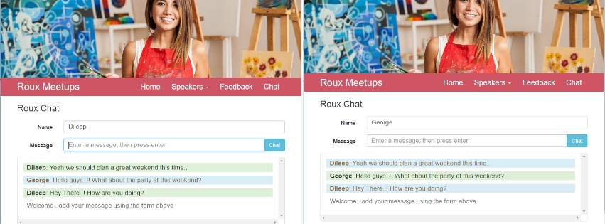

This is the repository for my project:
# Real-time Live Chat application along with full functionality website using Node.js, Express.js, Socket.io & Ajax.

My interest in building Full stack JavaScript websites that do more, made me find that Node.js and Express.js are perfect match.In this project, I have created the real time-live chat application along with a full featured website using these technologies.

[Node.js®](https://nodejs.org/en/) is a JavaScript runtime built on Chrome's V8 JavaScript engine. Node.js uses an event-driven, non-blocking I/O model that makes it lightweight and efficient. Node.js' package ecosystem, npm, is the largest ecosystem of open source libraries in the world.
[Express.js](http://expressjs.com/) is a fast, minimalist framework that sits on top of Node.js and allows you to build powerful single- and multi-page web applications and websites.

[Socket.IO](http://socket.io/) is a piece of middleware that enables real-time bidirectional event-based communication.The main idea behind Socket.IO is that you can send and receive any events you want, with any data you want.Using this middleware, I have created a instant real-time chat app, that broadcastes the messages to multiple users who are connected to the server by joining the chatroom on the client-side.

Along with this,i have created a full featured JavaScript website which hosts this real time chat app.In this website,i have installed each package and levarage Node features from within Express, built an application with EJS template engine; created more flexible modular codes; built APIs to manage HTTP requests to add and delete content dynamically using Ajax requests and configure more complex routing.

## Features

- Multiple users can join a chat room by each entering a unique username on website load.
- Users can type chat messages to the chat room.
- A notification is sent to all users when a user joins or leaves the chatroom.
- Users can add/delete feedback content dynamically on the website without reloading.

## Instructions

1. Make sure you have these installed on your PC,MAC or Linux
	- [node.js](http://nodejs.org/)
2. Download the zip, and extract to the folder named Expressjs.
3. Then open the CMD or Terminal Bash from this folder.
4. Run `> npm install` to install the project dependencies.
5. Run `> npm start` command to start the automation.

## More Stuff
For more projects and coding stuff, follow me @[Dileep Kumar](https://github.com/dileepkumar9030)
